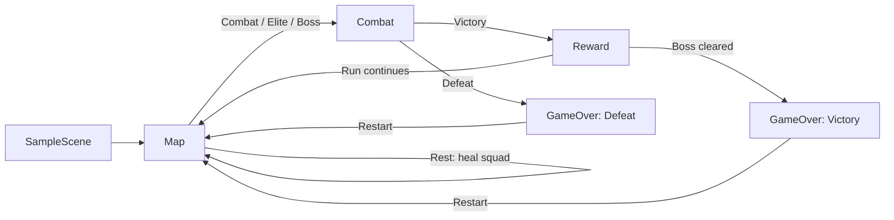

# Tactical Prototype

**Tactical Prototype** is a Unity 6 vertical slice for a turn-based tactical roguelite. It combines axial-grid combat with piece-selection turns, route selection, persistent squad state, post-combat rewards, elite encounters, and a multi-phase boss in one playable run.

Gameplay rules live in a Unity-independent `Game.Core` assembly. Scenes, input, UI, data authoring, validation, automated tests, and reproducible Linux builds form the integration layer around it.

> **Development status — July 25, 2026:** vertical slice in active development. Phase 1 is feature-complete (automated regression green) pending manual first-time-player validation. [Phase 2](ROADMAP.md#phase-2--strategic-map) (strategic map) and [Phase 3](ROADMAP.md#phase-3--meaningful-progression) (meaningful progression) are fully verified and closed. Current work is [Phase 4](ROADMAP.md#phase-4--vertical-slice-content) — representative content, onboarding, and final-direction presentation.

## Play the current loop

### Requirements

- Unity Editor **6000.0.77f1** — the exact version recorded in [`ProjectSettings/ProjectVersion.txt`](ProjectSettings/ProjectVersion.txt).
- Unity Hub is recommended for installing that editor version.
- Linux Build Support is required only for the standalone Linux build workflow.

Unity Package Manager restores committed dependencies when the project opens, including URP, Input System, uGUI, Unity Test Framework, and MCP for Unity.

### Quick start

1. Add this directory as a project in Unity Hub and open it with Unity `6000.0.77f1`.
2. Wait for package resolution and script compilation to finish.
3. Open [`Assets/Scenes/SampleScene.unity`](Assets/Scenes/SampleScene.unity).
4. Press **Play**.
5. The bootstrap scene creates a run and loads **Map**. Click a colored node to continue to combat.

The playable flow:



During a run, HP and acquired upgrades persist across encounters. Available map nodes lead to normal combat, elite combat, rest, or the boss. Shop remains future scope and is not generated. A victory presents three reward cards — select a card, then choose which piece receives it before the run continues.

## Controls

### Combat

Turns alternate between teams. Before acting, click an ally to select it — the action panel and ability buttons appear once a piece is selected.

| Input | Action |
| --- | --- |
| Left click on ally | Select that piece for the current turn |
| Left click on tile | Move selected piece to a legal tile |
| Left click on enemy | Attack a legal target, or confirm an ability target |
| Ability button or `1`–`9` | Select an active ability |
| Right click or `Esc` | Clear selection or cancel ability targeting |
| `Space` | Pass the turn |
| `Enter` | Activate the focused UI control; pass when no submit-capable control is focused |
| Left or right click during feedback | Fast-forward the active movement, impact, healing, or death feedback |
| Ctrl + mouse / Ctrl + `Space` | Camera orbit, pan, zoom, and reset (reserved for camera controls) |

Each unit gets **one action per turn**: **move, attack, use an ability, or pass**. A unit cannot move and then attack in the same turn. The click that fast-forwards feedback is consumed and does not pass through to the board or UI.

### Map

| Input | Action |
| --- | --- |
| Left click on a colored node | Enter the encounter (combat, elite, rest, or boss) |

## What is implemented

### Tactical combat

- **Explicit piece selection**: turns alternate by team. Click an ally to select it before acting. Selection clears after each action, and the action panel hides until a new piece is chosen.
- **Team-alternating turn system**: each team's pieces act in descending initiative before switching sides, replacing the old cyclic initiative loop.
- Axial-coordinate board, pathfinding, movement range, attack range, and queen-death victory conditions.
- Typed action evaluation and execution for move, attack, ability, and pass actions. The HUD and world highlights use the same Core legality contract.
- Active and passive abilities with mana, healing, damage, buffs, debuffs, auras, durations, and turn/death triggers. Passing recovers configured mana.
- Player-facing turn order, HP, mana, ability costs, legal-target highlights, and explicit rejection feedback.
- Interpolated movement and distinct damage, healing, mana, buff, debuff, passive, and death presentation with click-to-skip input gating.
- Strategy-based normal, elite, and boss AI. Boss phase mechanics with persistent phase toast presentation.
- Free-look combat camera with orbit, pan, zoom, and Ctrl+Space reset.

### Run and progression

- Procedural layered route map with combat, elite, rest, and boss nodes. Shop remains a future node type and is not generated.
- Persistent squad objects across scenes, including HP, bonus stats, and learned abilities.
- Three deterministic reward choices drawn from stat boosts and active abilities. Player chooses both the reward card and which piece receives it.
- Authored reward pools per encounter tier (normal, elite, boss) with reciprocal ability exclusions (e.g., Power Strike and Fireball exclude each other).
- Normal enemy rosters cycle by cleared-combat index; elite and boss nodes use their dedicated rosters and AI.
- Victory and defeat outcomes converge on a restartable Game Over scene.

## Architecture

The assembly boundaries keep game rules testable without loading Unity:

| Layer | Responsibility | Key locations |
| --- | --- | --- |
| `Game.Core` | Board, axial coordinates, pathfinding, pieces, turns, actions, abilities, AI, map graph, run state, deterministic random streams | [`Assets/Scripts/Core`](Assets/Scripts/Core) |
| `Game.Data` | ScriptableObject adapters for characters, abilities, elites, and bosses | [`Assets/Scripts/Unity/Data`](Assets/Scripts/Unity/Data), [`Assets/Data`](Assets/Data) |
| `Game.Unity` | Scene orchestration, input, HUD, board/piece presentation, map, rewards, combat camera, and game-over UI | [`Assets/Scripts/Unity`](Assets/Scripts/Unity), [`Assets/Scenes`](Assets/Scenes) |
| `Game.Editor` | Baseline validation, scene tooling, and transactional Linux build/smoke automation | [`Assets/Editor`](Assets/Editor) |
| Tests | Fast domain/integration coverage in EditMode and production-scene behavior in PlayMode | [`Assets/Scripts/Tests/EditMode`](Assets/Scripts/Tests/EditMode), [`Assets/Scripts/Tests/PlayMode`](Assets/Scripts/Tests/PlayMode) |

`Game.Core.asmdef` has no Unity references. Dependencies point inward: authored Unity data creates Core models, and MonoBehaviours translate Core events and state into scenes, UI, input, and feedback.

The required build scene order is validated exactly as:

```text
SampleScene -> Combat -> Reward -> Map -> GameOver
```

This is build-index order, not the runtime transition order shown in the flow diagram above.

## Validation and tests

### In the Editor

1. Run **Tools → TacticalRogue → Validate Project Baseline**.
2. Open **Window → General → Test Runner**.
3. Run all **EditMode** tests, then all **PlayMode** tests.
4. Confirm the Console contains no errors.

The baseline validator checks required scene order, singleton components, serialized references, Input System event modules, teams, prefabs, materials, and enemy rosters. The same validator runs as a pre-build guard.

### From the command line

Do not keep this project open in another Unity Editor process while running batch tests.

```bash
export UNITY_EDITOR="/path/to/Unity/Hub/Editor/6000.0.77f1/Editor/Unity"
mkdir -p Builds/Logs

"$UNITY_EDITOR" -batchmode -projectPath "$PWD" \
  -runTests -testPlatform editmode \
  -testResults "$PWD/Builds/Logs/editmode-latest.xml" \
  -logFile "$PWD/Builds/Logs/editmode-tests.log"

"$UNITY_EDITOR" -batchmode -projectPath "$PWD" \
  -runTests -testPlatform playmode \
  -testResults "$PWD/Builds/Logs/playmode-latest.xml" \
  -logFile "$PWD/Builds/Logs/playmode-tests.log"
```

**Latest verified snapshot (Phase 3 closure):** the final verified run passed all **230 EditMode** tests, all **31 PlayMode** tests, and all focused suites. The baseline validator succeeded, and the Unity Console reported zero errors, warnings, or logs. Unity MCP was idle with no compilation, blocking, or stale state.

## Reproducible Linux build

### Editor workflow

1. Run **Tools → TacticalRogue → Build → Linux Development**.
2. Find the validated player at `Builds/Linux/TacticalPrototype.x86_64`.
3. Run **Tools → TacticalRogue → Smoke → Linux Runtime** to smoke-test that build.

### Batch or CI workflow

From the project root:

```bash
export UNITY_EDITOR="/path/to/Unity/Hub/Editor/6000.0.77f1/Editor/Unity"
mkdir -p Builds/Logs

"$UNITY_EDITOR" -batchmode -quit -projectPath "$PWD" \
  -executeMethod StandaloneBuildAutomation.BuildLinuxDevelopmentBatch \
  -logFile "$PWD/Builds/Logs/linux-build.log"

"$UNITY_EDITOR" -batchmode -quit -projectPath "$PWD" \
  -executeMethod StandaloneBuildAutomation.RunLinuxRuntimeSmokeBatch \
  -logFile "$PWD/Builds/Logs/linux-smoke-editor.log"
```

The build uses `StandaloneLinux64`, Development, Strict Mode, a clean build cache, and the validated scene order. It builds into isolated staging, verifies the package, and only then replaces `Builds/Linux`; a failed build or promotion preserves the previous valid player.

The runtime smoke launches the player headlessly for up to 20 seconds and requires managed initialization, a logged run seed, and successful Map loading. It removes `SDL_IM_MODULE`, `QT_IM_MODULE`, and `XMODIFIERS` only from the child player to isolate the diagnosed `SDL_Fcitx_Init` host crash.

| Evidence | Location |
| --- | --- |
| Packaging status | `Builds/Logs/linux-packaging-status.txt` |
| Runtime smoke status | `Builds/Logs/linux-runtime-smoke-status.txt` |
| Timestamped player smoke logs | `Builds/Logs/linux-runtime-smoke-*.log` |
| Promoted Linux player | `Builds/Linux/` |

`Builds/` is intentionally ignored by Git; these artifacts are local or CI evidence.

## Reproducing a run

Every new run records its seed in the Unity Console and player log:

```text
Run started (seed=123456) with 2 pieces, 8 map nodes
```

`RunManager.StartNewRun(int seed)` is the deterministic entry point used by tests and debug harnesses. The seed drives map generation, while stable domain-specific streams combine the run seed with combat progress for reward options and reward recipients. Because the streams are independent, adding a random draw to one reward concern does not perturb the other.

For a bug report, capture:

- the `Run started (seed=...)` line;
- the selected route and current combat index;
- the Unity Console or player log;
- whether the issue occurred in the Editor or the Linux player.

## Optional: MCP for Unity

The project pins MCP for Unity to `v9.7.3` in [`Packages/manifest.json`](Packages/manifest.json). It is development tooling, not a runtime dependency.

The local server requires `uv`/`uvx` on the host `PATH`:

```bash
curl -LsSf https://astral.sh/uv/install.sh | sh
```

Ensure `~/.local/bin` is visible to applications launched from the desktop, restart Unity, then use **Start Server** in the MCP for Unity window. The configured client endpoint is `http://127.0.0.1:8080/mcp`. After a script domain reload, stop and start the server if the client reports a stale connection or handshake failure.

## Current limitations

- Phase 1's only remaining closure gate is manual first-time-player usability validation; automated regression is green.
- Audio cues are intentionally deferred to Phase 4 content polish.
- Shop support is future scope; Shop nodes are not generated until a transaction system is available.
- The map and reward UI are functional but not yet the final vertical-slice presentation.
- The supported automated standalone workflow currently targets Linux only.
- The combat camera is functional but does not yet have dedicated on-screen key hints for orbit/pan/zoom.

See [`ROADMAP.md`](ROADMAP.md) for phase outcomes, exit criteria, current evidence, and the immediate work order. Historical feature milestones are recorded in [`CHANGELOG.md`](CHANGELOG.md).
