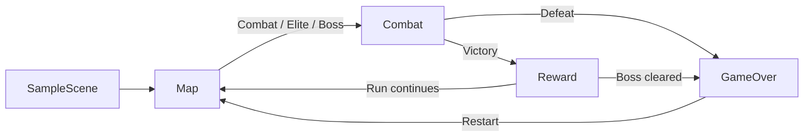

# Tactical Prototype architecture

This document maps the current Unity 6 vertical slice to its assembly boundaries, scene flow, and validation seams. The authoritative product scope and phase status remain in [`README.md`](../README.md) and [`ROADMAP.md`](../ROADMAP.md).

## Layers and dependencies

The project uses four assemblies with dependencies directed toward the domain:

| Layer | Assembly | Responsibility | References |
| --- | --- | --- | --- |
| Domain | `Game.Core` | Board and axial coordinates, tiles and pieces, teams, turns, actions, abilities, AI, map graph, run state, and deterministic random streams | None; `noEngineReferences` is enabled |
| Data | `Game.Data` | Unity-authored data adapters for characters, abilities, elites, and bosses | `Game.Core` |
| Runtime presentation | `Game.Unity` | Scene orchestration, input, combat runner/views/HUD, map, rewards, and game-over UI | `Game.Core`, `Game.Data`, Input System, uGUI |
| Editor tooling | `Game.Editor` | Baseline validation, scene setup, and transactional Linux build/runtime-smoke automation | `Game.Core`, `Game.Data`, `Game.Unity`, Input System, uGUI; Editor platform only |

Assembly definitions are located at:

- [`Assets/Scripts/Core/Game.Core.asmdef`](../Assets/Scripts/Core/Game.Core.asmdef)
- [`Assets/Scripts/Unity/Data/Game.Data.asmdef`](../Assets/Scripts/Unity/Data/Game.Data.asmdef)
- [`Assets/Scripts/Unity/Game.Unity.asmdef`](../Assets/Scripts/Unity/Game.Unity.asmdef)
- [`Assets/Editor/Game.Editor.asmdef`](../Assets/Editor/Game.Editor.asmdef)

Tests are split by execution boundary. `Game.Core.Tests` is Editor-only and references all production assemblies plus the Unity Test Runner; `Game.PlayMode.Tests` runs in player-compatible contexts and references Core, Data, and Unity. Their definitions are under [`Assets/Scripts/Tests`](../Assets/Scripts/Tests).

## Scene and runtime flow

The validated **build-index** order is:

```text
SampleScene -> Combat -> Reward -> Map -> GameOver
```

This is not the same as every runtime transition. `SampleScene` contains `RunBootstrapper`, which starts a run through the persistent `RunManager`. The manager keeps `RunState`, current combat index, phase, and outcome across scene loads. `MapView` presents generated nodes and dispatches the selected node; combat runs in `Combat`, a cleared combat opens `Reward`, and the reward returns to `Map`. Defeat or boss victory opens `GameOver`; the outcome screen restarts through the same manager.



Scene assets are in [`Assets/Scenes`](../Assets/Scenes), and the exact build list is in [`ProjectSettings/EditorBuildSettings.asset`](../ProjectSettings/EditorBuildSettings.asset). `Assets/Editor/SceneSetup.cs` is the editor-side scene construction and normalization tool; it is not a runtime dependency.

## Ownership rules

- Put game rules, legality checks, state transitions, AI decisions, and deterministic calculations in `Game.Core`.
- Keep ScriptableObject authoring and conversion in `Game.Data`; do not make Core depend on asset serialization.
- Keep MonoBehaviours, scene references, input actions, feedback timing, and visual state in `Game.Unity`.
- Keep validation and build orchestration in `Game.Editor`; runtime code must not depend on editor APIs.
- The combat HUD and board highlights consume the same Core action-legality contract as execution. Presentation may explain or animate a result, but it must not redefine legality.

## Testing and reproducibility

EditMode tests cover Core rules, data/integration contracts, baseline validation, and build automation. PlayMode tests cover combat feedback/UI interaction and production run-loop transitions. The documented commands and evidence locations are maintained in the [validation section of the README](../README.md#validation-and-tests).

`RunManager.StartNewRun(int seed)` is the deterministic entry point. The seed drives map generation; stable `RunRandomStream` values derive independent streams for reward options and recipients, so adding a draw in one concern does not perturb another. Capture the `Run started (seed=...)` log, selected route/combat index, and Unity or player log when reproducing a bug.

## MCP for Unity

MCP for Unity is pinned as development tooling in [`Packages/manifest.json`](../Packages/manifest.json). Use the resource-first workflow: inspect editor state and scene/project resources before mutations, then verify script compilation and Console errors after edits. The local MCP endpoint and connection recovery steps are documented in [README → Optional: MCP for Unity](../README.md#optional-mcp-for-unity).
